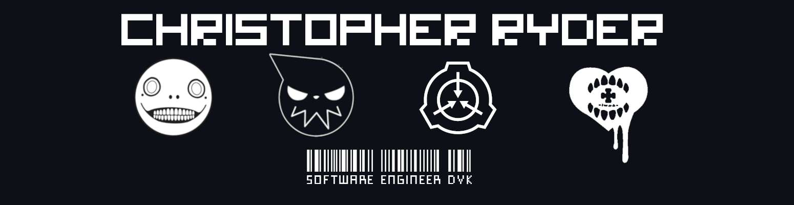

<!--
**Dikiv/Dikiv** is a ✨ _special_ ✨ repository because its `README.md` (this file) appears on your GitHub profile.

Here are some ideas to get you started:

- 🔭 I’m currently working on ...
- 🌱 I’m currently learning ...
- 👯 I’m looking to collaborate on ...
- 🤔 I’m looking for help with ...
- 💬 Ask me about ...
- 📫 How to reach me: ...
- 😄 Pronouns: ...
- ⚡ Fun fact: ...
-->
<p align="center">
  </a>
</p>
<p align="center">
<div style="text-align: center">


</p>
<br />


<!--START_SECTION:waka-->
**I'm an Early 🐤** 

```text
🌞 Morning                60 commits          ███░░░░░░░░░░░░░░░░░░░░░░   10.64 % 
🌆 Daytime                274 commits         ████████████░░░░░░░░░░░░░   48.58 % 
🌃 Evening                194 commits         █████████░░░░░░░░░░░░░░░░   34.40 % 
🌙 Night                  36 commits          ██░░░░░░░░░░░░░░░░░░░░░░░   06.38 % 
```


📊 **This Week I Spent My Time On** 

```text
🕑︎ Time Zone: Europe/Copenhagen

💬 Programming Languages: 
No Activity Tracked This Week
```


<!--END_SECTION:waka-->

</div>